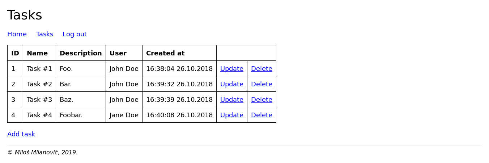

<p align="center">
	
</p>

# Overview

This is forked from [mmilanovic4/mvc](https://github.com/mmilanovic4/mvc).    My goal is to make this a template that can be used as a starting point.  So far I've only converted some of the Serbian to English.  
Now I'm working on the routing portion of it.   (It's still WIP and does not work out of the box.)

PHP MVC boilerplate with user authentication, basic security and MySQL CRUD operations.
Framework was developed during the final year of university. It was used for some private projects, however I highly suggest you to use Laravel or some other popular framework for your work.

## Requirements

- **Web server:** Apache with mod_rewrite enabled
- **Database server:** MySQL
- PHP 7.x

### Optional

- ApiGen / phpDocumentor
- PHPUnit

## Login operation

If you imported database data from `sys/db/dump.sql`, you could authenticate with following credentials:

- john.doe@example.com / admin
- jane.doe@example.com / admin

If you're manually adding user to `users` table, don't forget to append salt from `sys/Config.php` before hashing with SHA-512 algorithm.


## CRUD operations

Each database table should have appropriate model file. For example, table `tasks` have `app/models/TaskModel.php`. There you need to hardcode table name in protected `$tableName` property and eventually add new functions. Provided functions with basic model are:

- read
- readAll
- create
- update
- delete



## Router

All routes should be placed inside `routes.php`. Each route must have following properties:

- Name of the controller whom the route belongs to
- Name of the controller's method (the route callback)
- Request URI, represented via PCRE

For example, if we have following code:

```
...
new Route('Home', 'index', '|^/?$|'),
...
```

it means that when user visits URI which matched RegEx `|^/?$|`, `index.php` will instantiate `HomeController.php` and call his `index` method.

### RegEx cheat sheet

Route                    | Regex
:------------------------|:-------------------
`/`                      | \|^/?$\|
`users/`                 | \|^users/?$\|
`users/create/`          | \|^users/create/?$\|
`users/update/15/`       | \|^users/update/([0-9]+)/?$\|
`users/delete/4/`        | \|^users/delete/([0-9]+)/?$\|
`store/iphone-8-64gb/`   | \|^store/([a-z0-9]+(?:\\-[a-z0-9]+)*)/?$\|
Anything                 | \|^.*$\|

## Security

Framework provides basic security mechanisms.

### SQL injection

`Model` class uses prepared statements and `Database` class uses PDO's DSN charset parameter to set connection encoding to `utf8`. It is impossible for an attacker to inject malicious SQL this way. For providing defense in depth, you can use input validation - for applications that demand higher level of security, I use input validation not only in PHP, but in MySQL also (via triggers).

- [OWASP - SQL Injection Prevention Cheat Sheet](https://github.com/OWASP/CheatSheetSeries/blob/master/cheatsheets/SQL_Injection_Prevention_Cheat_Sheet.md)

### XSS

For basic XSS protection (e.g. when we need to insert data in HTML body) you can use `Security` class. For example, if we need to insert `$DATA['user']` in our HTML, we would use following code:

```
...
<p><?= Security::escape($DATA['user']); ?></p>
...
```

However, that wouldn't protect us if we needed to insert data inside `<script>` tag, for example. Visit OWASP page for further instructions. If you want to use third-party library for defense in depth, HTML Purifier is a good one. For API responses in JavaScript, don't forget to use safe JavaScript functions and properties (e.g. `element.textContent`, jQuery `.text()` function etc.) when you need to populate the DOM.

- [OWASP - XSS (Cross-Site Scripting) Prevention Cheat Sheet](https://github.com/OWASP/CheatSheetSeries/blob/master/cheatsheets/Cross_Site_Scripting_Prevention_Cheat_Sheet.md)

### Data exposure

This framework provides user authentication functionallity, however if you intend to use it, in order for your users to be protected, you need to use HTTPS (HTTP + SSL). Without SSL encryption anyone could intercept the transmission from your browser to the server. Today, this is completely free thanks to initiatives like Let's Encrypt CA. I highly advise that you use HTTPS-related mechanisms like HSTS and HPKP as well.

- [OWASP - User Privacy Protection Cheat Sheet](https://github.com/OWASP/CheatSheetSeries/blob/master/cheatsheets/User_Privacy_Protection_Cheat_Sheet.md)
- [Let's Encrypt CA](https://letsencrypt.org)

## Documentation

Great tool for generating documentation is [ApiGen](https://github.com/ApiGen/ApiGen). You can install it via Composer (I prefer doing it globally) and simply run:

```
apigen generate --source MVC --destination MVC/docs
firefox docs/index.html &
```

Due to the recent problems with ApiGen and PHP 7.2, I used [phpDocumentor](https://www.phpdoc.org/) as an alternative. Install phpDocumentor and run:

```
phpdoc --directory MVC --target MVC/docs
```


## Other Resources:  
 -[PHP Class Example | Basics Of Class In PHP Tutorial](https://appdividend.com/2019/08/30/php-class-example-basics-of-class-in-php-tutorial/)